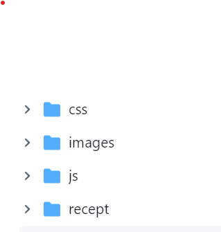

# Matsmart

## Introduktion

Jag har skapat en mat hemsida som bestar av HTML, CSS och Javascript kådning.

## Validering av HTML
Alla filer är validerade med hjälp av Markup Validation service.

## Validering av CSS
Alla filer är validerade med hjälp av Jigsaw CSS.

## Kontroll i Lighthouse
Alla filer är dessutom kontrollerade i Lighthouse.

## Desktop vs. Mobile

Text

## Plan vs resultatet

Text

## Teckenkoding

UTF-8

## Etik på en receptsida

Finns det något problem med namn på maträtter/efterrätter?
