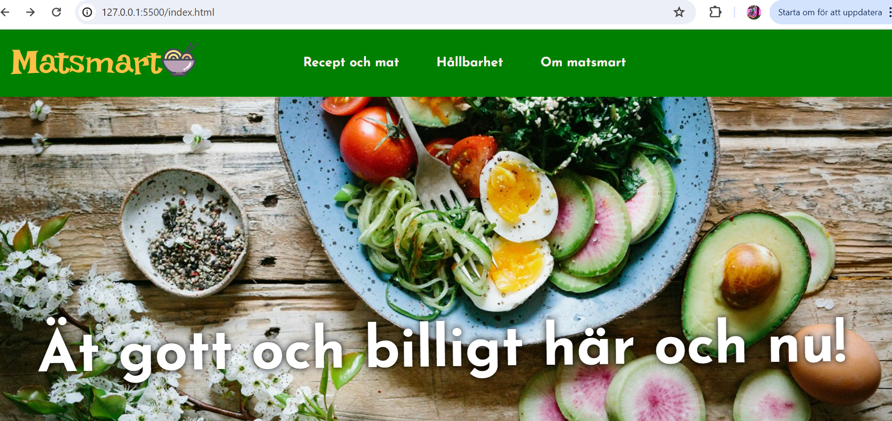
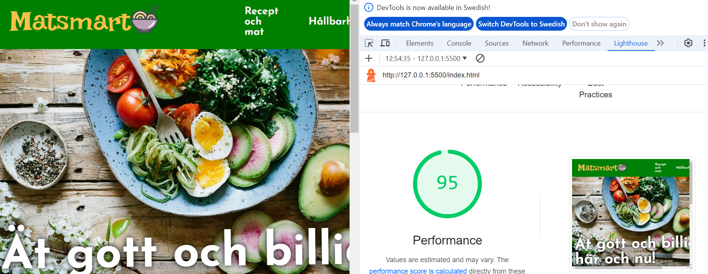
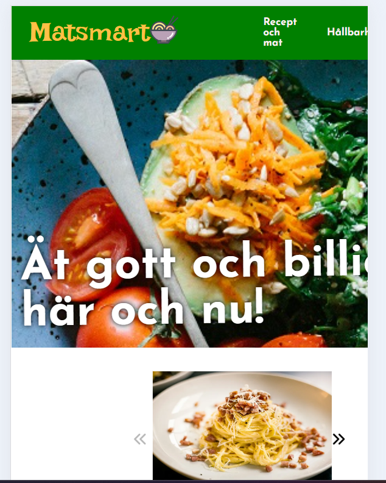

# Matsmart

## Introduktion
Jag har skapat en mat hemsida som bestar av HTML, CSS och Javascript kådning.

## Validering av HTML
Alla filer är validerade med hjälp av Markup Validation service.

## Validering av CSS
Alla filer är validerade med hjälp av Jigsaw CSS.

## Kontroll i Lighthouse
Alla filer är dessutom kontrollerade i Lighthouse.

## Desktop vs. Mobile
Här har jag även testat med hur sidorna hade fungerat på mobil så att det ser bra ut.

## Plan vs resultatet
Min plan på effekter har jag klarat av förutom att jag inte hann med att göra så att den övre menyn hänger med lite när man bläddrar nedåt på sidan. Sedan var det också för svårt att göra så att det zomas in när man tar pilen över bilder. Annars gjorde jag det jag skrev på effekter.
När det gäller layouten så blev det sig likt, använde mig av färgerna och gjorde som min planering på skjälva uppbyggnaden.

## Teckenkoding
Jag använde mig kodsystemet UTF-8. Detta eftersom UTF-8 har blivit den vanligaste kodsystemet för att skapa webbsiodr.

## Etik på en receptsida
Det kan uppstå vissa problem när det gäller namngivning på olika saker som exempel maträtter.
Ett exempel skulle kunna vara vad man kallade Chockladbollar förr i tiden här i sverige, det hade varit väldigt olämpligt nu för tiden att skriva det ordet.

## Upphovsrätt
Jag har även tagit alla mina bilder från Unsplash för att följa upphovsrätten. Om jag hade tagit bilder fårn internet finns det risk för att bli stämd eller något i den stilen.
